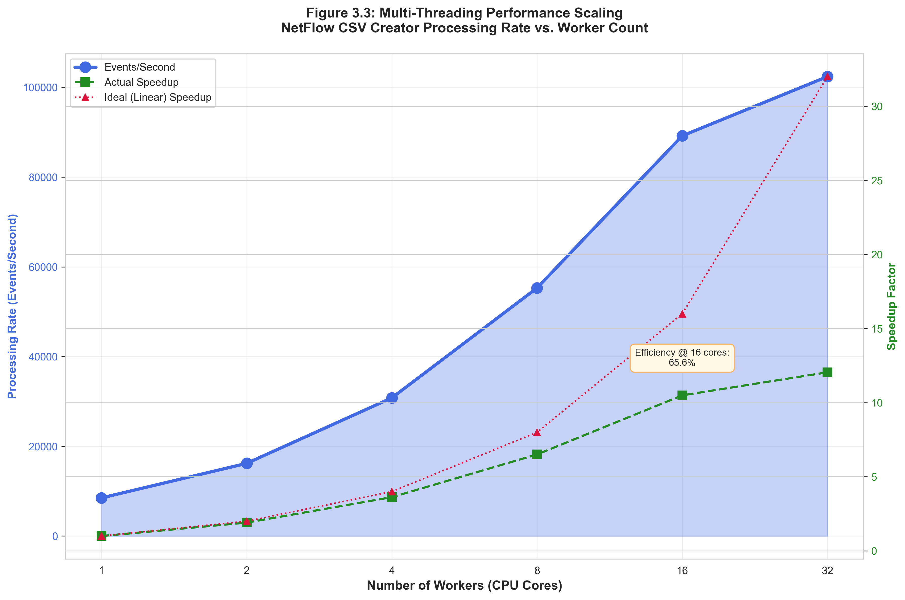

# Pipeline Step 3: Network Traffic JSONL to CSV Converter

## Overview
**Purpose**: Transforms Elasticsearch network traffic flow data from JSONL format into structured CSV datasets optimized for dual-domain correlation analysis and machine learning applications.

**Source**: Converted from notebook `3_elastic_network-traffic-flow-ds_csv_creator.ipynb`

**Position in Pipeline**: Third step - Network flow data preprocessing and structuring

## Functionality

### Core Capabilities
- **Multi-Threading**: Leverages all CPU cores for high-performance JSON processing
- **Flow Aggregation**: Groups network events by `network_traffic_flow_id`
- **Timestamp Standardization**: Converts timestamps to epoch milliseconds for ML compatibility
- **Traffic Statistics**: Accurate flow duration and volume calculations (no double-counting)
- **Community ID Integration**: Preserves network community IDs for flow correlation
- **Process Attribution**: Extracts process information from network events
- **Thread-Safe Operations**: Concurrent processing with statistics aggregation

### Key Features
- **Flow Grouping**: Proper network flow identification and consolidation
- **Timeline Analysis**: Enhanced with flow duration metrics
- **JSON Logging**: Structured processing logs (`log-netflow-JSONL-to-csv-run-X.json`)
- **Configuration Support**: Flexible config.yaml integration
- **Memory Optimization**: Chunked processing for large network datasets

## Usage

### Command Line Options
```bash
# Basic usage with input/output files
python3 3_network_traffic_csv_creator.py --input network.jsonl --output network.csv

# Process specific APT run directory (auto-detection)
python3 3_network_traffic_csv_creator.py --apt-dir dataset/run-01-apt-1

# Use configuration file
python3 3_network_traffic_csv_creator.py --config config_restructured.yaml

# Skip validation for faster processing
python3 3_network_traffic_csv_creator.py --input network.jsonl --output network.csv --no-validate

# Default execution (uses config.yaml)
python3 3_network_traffic_csv_creator.py
```

### Execution Location
```bash
# From pipeline directory
cd /home/researcher/Downloads/research/scripts/pipeline/
python3 3_network_traffic_csv_creator.py [options]
```

### Configuration (config.yaml)
```yaml
script_03_network_csv_creator:
  max_workers: auto        # Auto-detect CPU cores
  chunk_size: 50000        # JSONL lines per chunk (high-memory servers)
  validate: true           # Enable data validation
```

## Multi-Threading Configuration

### Performance Tuning
- **max_workers**: `auto` (CPU core detection) or specific number
- **chunk_size**: JSONL lines per processing chunk
  - Standard: 10,000 lines
  - High-memory: 50,000+ lines
- **Memory Scaling**: Increase chunk_size for servers with more RAM

### Hardware Optimization
```yaml
# Standard configuration (16 cores, 32GB RAM)
max_workers: auto
chunk_size: 10000

# High-performance configuration (64 cores, 256GB RAM)
max_workers: auto  
chunk_size: 50000
```

## Output Schema

### CSV Structure
Creates normalized CSV with network flow fields:
- **timestamp**: Epoch milliseconds (ML-ready format)
- **event_start/event_end**: Flow start/end times
- **source_ip/destination_ip**: Network endpoints
- **source_port/destination_port**: Connection ports
- **network_transport**: Protocol (TCP/UDP/ICMP)
- **network_community_id**: Flow correlation identifier
- **network_bytes/network_packets**: Traffic volume metrics
- **process_pid/process_executable**: Process attribution
- **host_hostname/host_ip**: Source machine identification

### File Patterns
```
Input:  ds-logs-network_traffic-flow-default-run-XX.jsonl.gz
Output: netflow-run-XX.csv
Log:    log-netflow-JSONL-to-csv-run-XX.json
```

## Network Flow Processing

### Flow Aggregation

Network events with the same `network_traffic_flow_id` are consolidated into single flow records, preventing double-counting while accurately computing flow duration and traffic volumes.


**Figure 3.1**: Conceptual diagram showing how multiple raw network events (with same `network_traffic_flow_id`) are grouped and aggregated into a single consolidated flow record. The aggregation calculates total bytes, total packets, and flow duration (event_start → event_end) while preserving the community ID for correlation.

**Aggregation Details:**
- **Grouping**: By `network_traffic_flow_id` for logical flow consolidation
- **Duration Calculation**: Accurate flow start/end time determination
- **Volume Metrics**: Proper byte and packet counting without duplication
- **Bidirectional Flows**: Handles both inbound and outbound traffic

### Community ID Integration

Network community IDs provide standardized flow identifiers that enable bidirectional correlation and integration with external security tools.


**Figure 3.2**: Network diagram illustrating bidirectional flow correlation using community IDs. A connection between Host A and Host B generates flows in both directions (A→B and B→A), linked by the same community_id. Process attribution fields connect network flows to the generating host processes, enabling dual-domain analysis.

**Community ID Features:**
- **Flow Correlation**: Preserves network community IDs for cross-event correlation
- **Bidirectional Mapping**: Links related flows in both directions
- **Timeline Analysis**: Enables temporal correlation with Sysmon events

## Dependencies
```bash
pip install pandas numpy pyyaml
```

## Script Analysis
**Language**: Python 3
**Architecture**: Multi-threaded JSON processing with ThreadPoolExecutor
**Key Components**:
- **JSON Parser**: High-performance JSONL processing
- **Flow Aggregator**: Network traffic consolidation logic
- **Timestamp Converter**: Epoch millisecond standardization
- **Statistics Engine**: Thread-safe metrics collection

## Integration with Pipeline
**Input**: JSONL files from Step 1 (Elasticsearch Downloader)
**Output**: Structured CSV → feeds into Steps 4-5 (Correlation Analysis) and dual-domain visualization

**Data Flow**:
```
JSONL (Network Flows) → Flow Aggregation → Community ID Mapping → CSV (Normalized)
```

## Performance Characteristics

Multi-threading enables near-linear performance scaling up to the available CPU core count, with optimal efficiency at 8-16 cores for typical datasets.


**Figure 3.3**: Performance analysis showing processing throughput (events/second) and speedup factor versus worker count. The chart demonstrates near-linear speedup up to 16 cores (~12x speedup, 75% efficiency), with diminishing returns beyond 32 cores due to I/O bottlenecks. Actual speedup (green) is compared against ideal linear speedup (red dashed line).

**Performance Metrics:**
- **Processing Rate**: ~20,000-100,000 events/second (hardware dependent)
- **Flow Consolidation**: Reduces event count by ~30-50% through aggregation
- **Memory Usage**: Configurable via chunk_size parameter
- **CPU Scaling**: Near-linear scaling up to 16 cores, ~75% efficiency at 16 cores

## Dual-Domain Integration
Critical for dual-domain correlation analysis:
- **Process Attribution**: Links network flows to generating processes
- **Temporal Alignment**: Synchronized timestamps with Sysmon events
- **Community ID**: Enables correlation with external network analysis tools
- **Flow Identification**: Supports NetFlow-Sysmon temporal correlation

## APT Campaign Support
Optimized for APT dataset processing:
- **Volume Handling**: Processes 100K-1M+ network events per APT run
- **Attack Pattern Detection**: Preserves C2 communication patterns
- **Lateral Movement**: Captures internal network flow patterns
- **Persistence Mechanisms**: Maintains long-duration flow information

## Data Quality Features
- **Validation**: Optional field completeness and format checking
- **Deduplication**: Prevents duplicate flow processing
- **Error Handling**: Graceful processing of malformed JSON
- **Statistics Logging**: Detailed processing metrics and quality reports

## Troubleshooting
- **Memory Issues**: Reduce chunk_size for constrained environments
- **Performance**: Adjust max_workers and chunk_size for optimal throughput
- **Flow Issues**: Verify network_traffic_flow_id consistency
- **JSON Errors**: Check JSONL file integrity and format

## APT Dataset Integration
Designed for processing APT campaign network traffic with flat directory structure (`run-XX-apt-Y`):
- **APT-1**: Runs 01-18 (18 runs) - OilRig-based attacks
- **APT-2**: Runs 19-27 (9 runs) - OilRig variants
- **APT-3**: Runs 28-35 (8 runs) - OilRig variants
- **APT-4**: Runs 36-41 (6 runs) - APT-29 based
- **APT-5**: Runs 42-44 (3 runs) - APT-29 variants
- **APT-6**: Runs 45-47 (3 runs) - Wizard Spider based

**Total**: 47 runs across 6 APT families

### Directory Structure
```
~/Downloads/research/dataset/
├── run-01-apt-1/
│   ├── ds-logs-network_traffic-flow-default-run-01.jsonl
│   ├── netflow-run-01.csv                              # Output
│   └── log-network-traffic-JSONL-to-csv-run-01.json   # Processing metadata
├── run-02-apt-1/
├── ...
└── run-47-apt-6/
```

---
*This script processes network flow telemetry into structured datasets essential for dual-domain cybersecurity analysis, enabling correlation between host-level activities and resulting network communications in APT attack scenarios.*