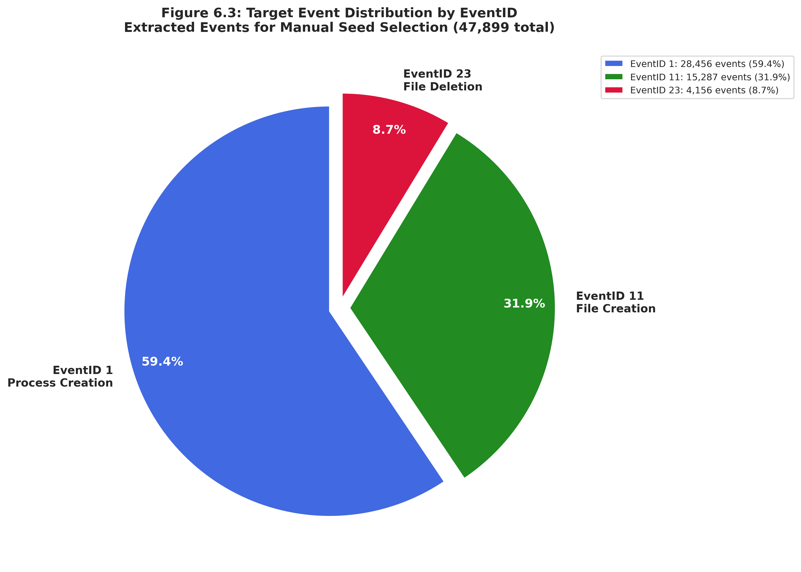

# Pipeline Step 6: Sysmon Seed Event Extractor

## Overview
**Purpose**: Extract target Sysmon events (EventID 1, 11, 23) from raw Sysmon data and prepare them for manual seed event selection with MITRE ATT&CK tactic/technique labeling.

**Position in Pipeline**: Sixth step - First stage of Sysmon dataset labeling

## Functionality

### Core Capabilities
- **Multi-EventID Extraction**: Extracts Process Creation (EventID 1), File Creation (EventID 11), and File Deletion (EventID 23) events
- **Manual Selection Framework**: Adds Seed_Event, Tactic, and Technique columns for analyst marking
- **Selection Preservation**: Preserves existing manual selections when re-run
- **Chronological Ordering**: Sorts events by timestamp for attack timeline analysis
- **Traceability**: Preserves original row numbers for dataset tracking
- **Human-Readable Timestamps**: Converts Unix milliseconds to readable format with millisecond precision

### Target EventID Types
**EventID 1 (Process Creation)**:
- Command line arguments
- Process GUIDs and PIDs
- Parent process relationships
- Executable image paths
- Primary indicators for attack command execution

**EventID 11 (File Creation)**:
- Target filename paths
- File creation timestamps
- Creating process information
- Indicators for malware staging, persistence, and data collection

**EventID 23 (File Deletion)**:
- Deleted filename paths
- Deletion timestamps
- Deleting process information
- Indicators for anti-forensics and cleanup operations

## Usage

### Prerequisites
**Required Dependencies**:
- Python 3.7+
- pandas library
- Raw Sysmon CSV files (output from Step 2)

### Execution Location
```bash
# From pipeline directory
cd /home/researcher/Downloads/research/scripts/pipeline/
python3 6_sysmon_seed_event_extractor.py --apt-type apt-1 --run-id 04

# Using direct file path
python3 6_sysmon_seed_event_extractor.py --sysmon-csv /path/to/sysmon-run-04.csv
```

### Command Line Options
```bash
# APT dataset mode (recommended)
python3 6_sysmon_seed_event_extractor.py --apt-type apt-1 --run-id 04

# Direct file mode
python3 6_sysmon_seed_event_extractor.py --sysmon-csv /path/to/sysmon.csv --output /path/to/output.csv

# Enable debug logging
python3 6_sysmon_seed_event_extractor.py --apt-type apt-4 --run-id 43 --debug
```

## Input Requirements

### Directory Structure
```
dataset/
├── apt-1/
│   ├── apt-1-run-04/
│   │   └── sysmon-run-04.csv          # Raw Sysmon data (from Step 2)
│   ├── apt-1-run-05/
│   │   └── sysmon-run-05.csv
│   └── ...
├── apt-2/
│   └── apt-2-run-21/
│       └── sysmon-run-21.csv
└── [apt-3 through apt-7]/
```

### Input Format
**Raw Sysmon CSV**: Output from Step 2 (sysmon_csv_creator.py)
**Required Columns**:
- EventID: Sysmon event type identifier
- timestamp: Unix milliseconds timestamp
- Computer: Hostname of event source
- CommandLine: Full command line (EventID 1)
- TargetFilename: File path (EventID 11, 23)
- ProcessGuid, ProcessId: Process identifiers
- ParentProcessGuid, ParentProcessId: Parent process identifiers
- Image, ParentImage: Executable paths

## Output Generated

### Primary Output
```
📄 all_target_events_run-XX.csv
├── Seed_Event      [EMPTY - for manual marking with 'x']
├── Tactic          [EMPTY - for MITRE ATT&CK tactic]
├── Technique       [EMPTY - for MITRE ATT&CK technique ID]
├── RawDatasetRowNumber  [Original row number from sysmon-run-XX.csv]
├── timestamp_h     [Human-readable: YYYY-MM-DD HH:MM:SS.mmm]
├── EventID         [1, 11, or 23]
├── Computer        [Hostname]
├── CommandLine     [Full command string]
├── TargetFilename  [File path for EventID 11/23]
├── ProcessGuid     [Process GUID]
├── ProcessId       [Process ID]
├── ParentProcessGuid [Parent process GUID]
├── ParentProcessId   [Parent process ID]
├── Image           [Process executable path]
├── ParentImage     [Parent executable path]
└── timestamp       [Original Unix milliseconds]
```

### Output Location
```
dataset/apt-X/apt-X-run-XX/all_target_events_run-XX.csv
```

### Example Statistics
```
📊 EXTRACTION SUMMARY:
   Total Sysmon events: 145,832
   Target events extracted: 47,899
   Events by EventID:
     EventID 1: 28,456 events (59.4%)
     EventID 11: 15,287 events (31.9%)
     EventID 23: 4,156 events (8.7%)
   Extraction rate: 32.8% of total events
```

### Extraction Funnel Visualization

The extraction process progressively narrows from all Sysmon events to analyst-marked seed events, creating a focused dataset of significant attack indicators.


**Figure 6.1**: Funnel diagram showing the four-stage filtering process. Starting with 145,832 raw Sysmon events (all EventIDs), the script filters to 47,899 target events (EventID 1, 11, 23 only - 32.8% retained). Analysts then review these events and mark 215 as seed events (0.14% of original dataset). The narrow focus on seed events enables efficient human-in-the-loop labeling while capturing critical attack operations.

### EventID Distribution in Extracted Events

The distribution of extracted events reflects the nature of attack activities, with process execution (EventID 1) dominating, followed by file operations.


**Figure 6.3**: Pie chart showing the breakdown of extracted target events by EventID type. Process Creation (EventID 1) comprises 59.4% (28,456 events), File Creation (EventID 11) comprises 31.9% (15,287 events), and File Deletion (EventID 23) comprises 8.7% (4,156 events). This distribution guides analysts toward the most informationally-rich event types for seed selection.

## Manual Selection Workflow

The manual selection workflow involves opening the extracted events CSV, reviewing attack indicators, marking seed events with MITRE ATT&CK labels, and saving the annotated dataset for lifecycle tracing.


**Figure 6.2**: Flowchart illustrating the analyst workflow for manual seed event selection. Starting with the extracted target events CSV, analysts review command lines and file operations, identify significant attack behaviors, mark seed events with 'x', annotate with MITRE ATT&CK tactic/technique labels, save the file, and optionally re-run the extractor to preserve selections. This human-in-the-loop process ensures high-quality ground truth labels for attack lifecycle tracing.

### Step 1: Open CSV File
Open `all_target_events_run-XX.csv` in Excel, LibreOffice Calc, or any CSV editor.

### Step 2: Review Event Data
Examine the following columns to identify attack-related events:
- **CommandLine**: Look for suspicious commands, PowerShell execution, reconnaissance
- **TargetFilename**: Identify malware staging, persistence files, exfiltration archives
- **Computer**: Track which hosts are compromised
- **timestamp_h**: Understand temporal attack progression

### Step 3: Mark Seed Events
For events that represent significant attack operations:
- **Seed_Event column**: Enter **'x'** (lowercase x) to mark as seed event
- **Tactic column**: Enter MITRE ATT&CK tactic (e.g., `initial-access`, `discovery`, `exfiltration`)
- **Technique column**: Enter MITRE ATT&CK technique ID (e.g., `T1059.001`, `T1016`, `T1041`)

### Step 4: Save and Re-run
- Save the CSV file (preserve CSV format)
- Re-run the script to preserve your selections while refreshing other data
- Selections are preserved by matching `RawDatasetRowNumber`

### Example Marking
```csv
Seed_Event,Tactic,Technique,RawDatasetRowNumber,timestamp_h,EventID,CommandLine
x,initial-access,T1659,487566,2025-05-24 23:19:21.858,11,C:\Users\Public\sandcat.exe
x,execution,T1059.001,601019,2025-05-24 23:20:58.619,1,cmd.exe /C powershell.exe;if ($?) {...}
x,discovery,T1016,781971,2025-05-24 23:22:49.443,1,cmd.exe /C ipconfig /all
x,collection,T1119,685699,2025-05-24 23:22:01.255,1,powershell.exe -ExecutionPolicy Bypass -C "$env:APPDATA;$files=..."
x,exfiltration,T1041,919714,2025-05-24 23:24:49.316,1,powershell.exe -ExecutionPolicy Bypass -C "Import-Module .\upload.ps1..."
```

## Integration with Pipeline

### Input Dependencies
**Step 2 Output**: Raw Sysmon CSV (sysmon-run-XX.csv)
**Required Structure**: `dataset/apt-X/apt-X-run-XX/` directories

### Output Integration
**Next Step (Step 7)**: Attack Lifecycle Tracer uses `all_target_events_run-XX.csv` with marked seed events
**Manual Process**: Analyst reviews and marks seed events between Steps 6 and 7

**Data Flow**:
```
Raw Sysmon CSV → Event Extraction → Manual Marking → Attack Lifecycle Tracing
     (Step 2)         (Step 6)      [Human Analysis]         (Step 7)
```

## Performance Characteristics

### Processing Metrics
- **Runtime**: 10-60 seconds per APT run (depends on dataset size)
- **Memory Usage**: 500MB - 2GB (scales with Sysmon event count)
- **Extraction Rate**: Typically 20-40% of total Sysmon events
- **EventID Distribution**: ~60% EventID 1, ~30% EventID 11, ~10% EventID 23

### Scalability
- **Small Datasets**: 10K-50K Sysmon events → ~3K-15K target events
- **Medium Datasets**: 50K-200K Sysmon events → ~15K-60K target events
- **Large Datasets**: 200K+ Sysmon events → ~60K+ target events
- **Re-run Performance**: Fast (selections preserved, no re-analysis needed)

## Selection Preservation

### How It Works
1. When re-running the script, it checks if output file already exists
2. Reads existing file and extracts all Seed_Event/Tactic/Technique selections
3. Uses `RawDatasetRowNumber` as unique key to match selections
4. Applies preserved selections to newly extracted events
5. Reports number of selections preserved

### Benefits
- **Iterative Workflow**: Refine selections across multiple sessions
- **Safe Re-runs**: Won't lose manual work if script is re-executed
- **Data Updates**: Can refresh timestamp formatting or column structure while keeping selections
- **Collaboration**: Multiple analysts can work on different time windows

## Supported APT Types

### APT Dataset Coverage
```
apt-1: Runs 01-20, 51
apt-2: Runs 21-30
apt-3: Runs 31-38
apt-4: Runs 39-44
apt-5: Runs 45-47
apt-6: Runs 48-50
apt-7: Run 52 (test dataset)
```

## Quality Assurance

### Validation Features
- **EventID Validation**: Only extracts EventID 1, 11, 23
- **Timestamp Validation**: Handles invalid/negative timestamps gracefully
- **Column Existence**: Creates missing optional columns with null values
- **Row Number Tracking**: Maintains traceability to original dataset
- **Selection Validation**: Preserves only valid selections (non-empty strings)

### Error Handling
- **Missing Files**: Clear error messages with expected file locations
- **Invalid Run IDs**: Validates run ID is in valid range for APT type
- **Corrupt Data**: Graceful handling of malformed CSV rows
- **Timestamp Issues**: Marks invalid timestamps as 'INVALID_TIMESTAMP'

## Research Applications

### Threat Intelligence
- **Attack Pattern Identification**: Manual review reveals novel TTPs
- **Campaign Characterization**: Tactic/technique distribution per APT campaign
- **Behavioral Signatures**: Unique command patterns and file operations
- **Temporal Analysis**: Attack timing and sequencing patterns

### Machine Learning
- **Training Data Preparation**: Labeled seed events for supervised learning
- **Feature Engineering**: Command line, file path, and process relationship features
- **Ground Truth**: Human-validated attack event labels
- **Imbalanced Learning**: Seed events (rare) vs benign events (common)

## Troubleshooting

### Common Issues
**File Not Found**:
- Verify APT type and run ID are correct
- Check that Step 2 (Sysmon CSV Creator) has been completed
- Ensure sysmon-run-XX.csv exists in expected location

**No Events Extracted**:
- Verify input file contains EventID 1, 11, or 23
- Check that EventID column exists and has correct values
- Review debug logs with `--debug` flag

**Selections Not Preserved**:
- Ensure CSV format is maintained (no conversion to XLSX)
- Verify RawDatasetRowNumber column exists and hasn't been modified
- Check that Seed_Event/Tactic/Technique columns weren't renamed

### Debug Mode
Enable detailed logging to troubleshoot issues:
```bash
python3 6_sysmon_seed_event_extractor.py --apt-type apt-1 --run-id 04 --debug
```

---
*This seed event extractor provides the foundation for human-in-the-loop attack labeling, enabling analysts to identify and mark significant attack events for downstream lifecycle tracing and dataset labeling.*
