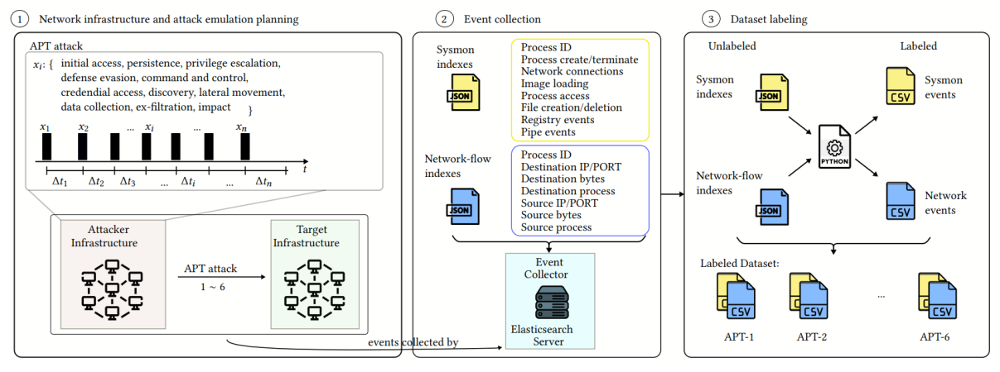

# FullAPT2025: Dual-Domain APT Attack Dataset

Dataset: [Link](https://zenodo.org/records/17363885)

This repository presents the documentation related to the production of FullAPT2025, the ultimate cybersecurity dataset based on data collection of emulated APT attacks.

FullAPT2025 features:
- 06 APT attacks.
- Total of 54 different TTPs (Tactics, Techniques, and Procedures).
- Dataset containing Host events (based on Sysmon events) and network events (based on network flows). In this way, we believe we capture attack patterns in both domains: host-domain and network-domain.

The objective of this repository is to provide documentation for understanding:

- How this dataset was generated?
- How this dataset was labeled?

<!-- A comprehensive 9-step pipeline for labeling cybersecurity datasets combining Sysmon (host-level) and NetFlow (network-level) events for Advanced Persistent Threat (APT) attack analysis. -->


**Figure 1**: Dataset Generation Methodology consists of three phases. Phase 1 is the APT attack emulation over a virtual network. Phase 2 is the raw dataset generation. And, Phase 3 involves the proceessing to create the labeled datasets.

SYSMON DATASET ANALYSIS

  | APT Type | Total Events | Benign     | Malicious | % Malicious | Top Tactics                 |
  |----------|--------------|------------|-----------|-------------|----------------------------------------------|
  | apt-1    | 14,805,327   | 14,690,929 | 114,398   | 0.77%       | persistence (50k), discovery  (32k)           |
  | apt-2    | 7,405,219    | 7,385,799  | 19,420    | 0.26%       | discovery (8.7k), exfiltration   (3.2k)        |
  | apt-3    | 3,360,366    | 3,337,622  | 22,744    | 0.68%       | exfiltration (4.8k), discovery   (6.4k)        |
  | apt-4    | 8,354,269    | 7,491,072  | 863,197   | 10.33%      | command-and-control (473k),  discovery (220k) |
  | apt-5    | 4,330,686    | 4,296,976  | 33,710    | 0.78%       | discovery (10k), execution  (2.6k)            |
  | apt-6    | 3,747,842    | 3,668,696  | 79,146    | 2.11%       | persistence (34k),  lateral-movement (16k)    |
  | TOTAL    | 42,003,709   | 40,871,094 | 1,132,615 | 2.70%       | -                 |

  Key Insight: APT-4 shows significantly higher malicious activity (10.33%) compared to other
  campaigns.

  ---
  NETFLOW DATASET ANALYSIS

  | APT Type | Total Events | Benign     | Malicious | % Malicious | Top Tactics                 |
  |----------|--------------|------------|-----------|-------------|----------------------------------------------|
  | apt-1    | 38,077,363   | 33,695,504 | 4,381,859 | 11.51%      | command-and-control (3.1M),  No-Tactic (1.1M) |
  | apt-2    | 12,777,265   | 12,636,254 | 141,011   | 1.10%       | No-Tactic (69k), discovery  (22k)             |
  | apt-3    | 9,568,997    | 9,303,859  | 265,138   | 2.77%       | No-Tactic (199k), exfiltration   (11k)         |
  | apt-4    | 9,526,040    | 9,271,070  | 254,970   | 2.68%       | No-Tactic (172k), discovery  (31k)            |
  | apt-5    | 2,980,222    | 2,916,896  | 63,326    | 2.12%       | No-Tactic (34k), discovery  (9.6k)            |
  | apt-6    | 4,551,384    | 4,435,908  | 115,476   | 2.54%       | collection (44k), execution  (22k)            |
  | TOTAL    | 77,481,271   | 72,259,491 | 5,221,780 | 6.74%       | -                 |


## Repository Structure

```
attack-emulation/    # details on how the APT attacks were emulated
├── virtual-network/        # how it virtual network was built
└── apt-attacks/            # how apt attacks were emulated
scripts/
├── pipeline/        # 9-step production pipeline with documentation
├── exploratory/     # (currently not available)
├── batch/           # (currently not available)
└── config/          # (currently not available)
```

<!-- ## Pipeline Steps

1. Elasticsearch data extraction
2. Sysmon CSV creation
3. NetFlow CSV creation  
4. Temporal causation correlation
5. Comprehensive correlation analysis
6. Seed event extraction (human-in-the-loop)
7. Attack lifecycle tracing
8. Labeled Sysmon dataset creation
9. Labeled NetFlow dataset creation

## Documentation

Complete documentation available in `scripts/pipeline/PIPELINE_OVERVIEW.md` -->

## Research Purpose

This repository supports academic research on dual-domain cybersecurity dataset labeling techniques and APT attack detection methodologies.
Updated Thu Oct 16 11:29:39 AM KST 2025
