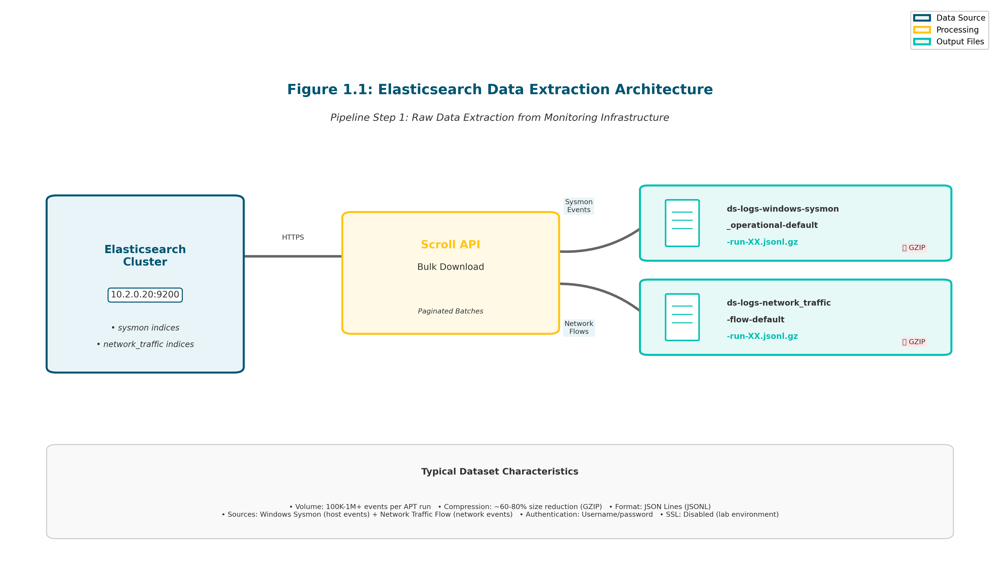

# Pipeline Step 1: Elasticsearch Index Downloader

## Overview
**Purpose**: Downloads cybersecurity data from Elasticsearch clusters containing Windows event logs and network traffic data for APT attack analysis.

**Source**: Converted from notebook `1_elastic-index-downloader.ipynb`

**Position in Pipeline**: First step - data extraction from monitoring infrastructure

## Architecture Overview

The Elasticsearch data extraction architecture consists of three main components: the Elasticsearch cluster, the scroll API mechanism for bulk downloads, and compressed JSONL outputs for downstream processing.


**Figure 1.1**: System architecture showing Elasticsearch cluster connection, scroll API pagination, and dual output streams (Sysmon and NetFlow JSONL files). The scroll API enables memory-efficient bulk downloads of large datasets.

## Functionality

### Core Capabilities
- **Elasticsearch Integration**: Connects to secure Elasticsearch cluster (https://10.2.0.20:9200)
- **Data Extraction**: Downloads Windows Sysmon events and network traffic flows
- **JSONL Output**: Saves data in JSON Lines format for efficient processing
- **Index Discovery**: Automatically discovers available indices with pattern matching
- **Bulk Download**: Uses Elasticsearch scroll API for large dataset extraction

### Data Sources
- **Sysmon Events**: Windows system monitoring events (`sysmon` keyword)
- **Network Traffic**: Network flow data (`network_traffic` keyword)
- **Target Indices**: Discovers indices matching APT campaign patterns

### Index Discovery Process

The script automatically discovers Elasticsearch indices by matching keywords against index names. This pattern-matching approach identifies relevant indices without manual configuration.


**Figure 1.2**: Pattern matching flowchart showing how keywords (`sysmon`, `network_traffic`) are matched against Elasticsearch index names to identify target indices for download. The discovery process handles multiple APT run patterns automatically.

## Usage

### Basic Execution
```bash
# From pipeline directory
cd /home/researcher/Downloads/research/dataset/scripts/pipeline/
python3 1_elastic_index_downloader.py
```

### Configuration
**Elasticsearch Connection**:
- Host: `https://10.2.0.20:9200`
- Authentication: Username/password (embedded)
- SSL: Disabled for lab environment

**Keywords**: `['sysmon', 'network_traffic']`
**Output Directory**: Current directory (`./`)

### Output Files
Creates JSONL files with patterns:
- `ds-logs-windows-sysmon_operational-default-run-XX.jsonl.gz`
- `ds-logs-network_traffic-flow-default-run-XX.jsonl.gz`

## Dependencies
```bash
pip install elasticsearch
```

## Script Analysis
**Language**: Python 3
**Lines of Code**: ~200-300 (estimated)
**Key Functions**:
- `connect_elasticsearch()`: Establishes secure connection
- `test_connection()`: Validates cluster connectivity
- `download_index()`: Bulk data extraction
- `discover_indices()`: Pattern-based index discovery

## Integration with Pipeline
**Input**: Elasticsearch cluster indices
**Output**: Raw JSONL files → feeds into Step 2 (Sysmon CSV Creator) and Step 3 (Network Traffic CSV Creator)

**Flow**:
```
Elasticsearch Cluster → JSONL Files → CSV Processing
```

## Security Considerations
- Contains embedded credentials (lab environment)
- SSL verification disabled
- Network access required to monitoring infrastructure

## Performance Notes
- Uses Elasticsearch scroll API for memory efficiency
- Processes large datasets (100K+ events per APT run)
- GZIP compression for storage efficiency
- Suitable for batch processing scenarios

## Troubleshooting
- Verify network connectivity to 10.2.0.20:9200
- Check Elasticsearch cluster health
- Ensure sufficient disk space for JSONL outputs
- Monitor memory usage during large downloads

---
*This script is the foundation of the dual-domain cybersecurity dataset pipeline, extracting raw telemetry data from the monitoring infrastructure for subsequent processing and analysis.*