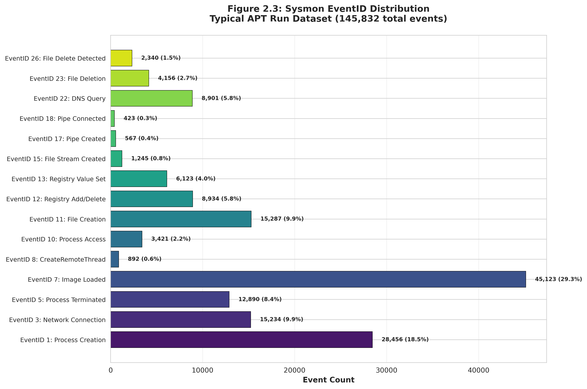

# Pipeline Step 2: Sysmon JSONL to CSV Converter

## Overview
**Purpose**: Transforms Windows Sysmon events from JSONL format into structured CSV datasets optimized for machine learning analysis and temporal correlation studies.

**Source**: Converted from notebook `2_elastic_sysmon-ds_csv_creator.ipynb`

**Position in Pipeline**: Second step - Sysmon data preprocessing and structuring

## Functionality

### Core Capabilities
- **Multi-Threading**: Leverages all CPU cores for high-performance processing
- **JSONL Processing**: Parses compressed Elasticsearch JSONL outputs
- **XML Parsing**: Extracts structured data from Windows event XML
- **Schema Normalization**: Creates consistent CSV schema across all APT runs
- **Data Validation**: Validates event structure and field completeness
- **Memory Optimization**: Chunked processing for large datasets

### Data Transformation
**Input**: JSONL files with Windows Sysmon events
**Output**: Structured CSV with normalized fields:
- Event metadata (EventID, timestamp, computer name)
- Process information (PID, executable, command line args)
- Network details (IP addresses, ports)
- File operations (creation, deletion, modification)
- Registry modifications

The transformation process converts nested JSON structures with embedded XML into flat, normalized CSV tables optimized for machine learning pipelines.


**Figure 2.2**: Before/After comparison showing the transformation from nested JSONL (with embedded XML event data) to flat normalized CSV schema. The process extracts and standardizes 40+ fields across all Sysmon event types, creating ML-ready tabular data with consistent column structure.

## Usage

### Command Line Options
```bash
# Basic usage with input/output files
python3 2_sysmon_csv_creator.py --input sysmon.jsonl --output sysmon.csv

# Process specific APT run directory (auto-detection)
python3 2_sysmon_csv_creator.py --apt-dir apt-1/apt-1-run-04

# Use configuration file
python3 2_sysmon_csv_creator.py --config config.yaml

# Skip validation for faster processing
python3 2_sysmon_csv_creator.py --input sysmon.jsonl --output sysmon.csv --no-validate

# Default (uses config.yaml if exists)
python3 2_sysmon_csv_creator.py
```

### Execution Location
```bash
# From pipeline directory
cd /home/researcher/Downloads/research/dataset/scripts/pipeline/
python3 2_sysmon_csv_creator.py [options]
```

### Configuration (config.yaml)
```yaml
script_02_sysmon_csv_creator:
  max_workers: auto        # Uses all CPU cores
  chunk_size: 50000        # Events per chunk (increase for high-memory servers)
  validate: true           # Enable data validation
```

## Multi-Threading Configuration

### Performance Tuning
- **max_workers**: `auto` (detects CPU cores) or specific number
- **chunk_size**: Events per processing chunk
  - Standard servers: 10,000
  - High-memory servers: 50,000+
- **Memory scaling**: Adjust chunk_size based on available RAM

### Multi-Threaded Processing Architecture

The script uses Python's `ThreadPoolExecutor` to process JSONL data in parallel across multiple CPU cores, with thread-safe operations for concurrent XML parsing and CSV aggregation.


**Figure 2.1**: Multi-threaded data flow showing JSONL input stream distributed across worker threads for parallel XML parsing and field extraction, with synchronized CSV aggregation. Each worker processes independent chunks for optimal CPU utilization.

### Example Configurations
```yaml
# Standard server (16 cores, 32GB RAM)
max_workers: auto
chunk_size: 10000

# High-performance server (64 cores, 256GB RAM)
max_workers: auto
chunk_size: 50000
```

## Output Schema

### CSV Structure
Creates standardized CSV with columns:
- **EventID**: Sysmon event type (1, 3, 11, 23, etc.)
- **TimeCreated**: Event timestamp (ISO format)
- **Computer**: Source machine hostname
- **ProcessId**: Process identifier
- **Image**: Executable path
- **CommandLine**: Process command line arguments
- **DestinationIp/Port**: Network connection details
- **TargetFilename**: File operation targets
- **User**: Security context

### EventID Distribution

Sysmon generates 26 different event types, each capturing specific system behaviors. The distribution varies by campaign activity, with process creation (EventID 1) and network connections (EventID 3) typically being the most frequent.


**Figure 2.3**: Horizontal bar chart showing typical EventID distribution in an APT dataset run (145,832 total events). Process creation (EventID 1) dominates at ~19.5%, followed by image loads (EventID 7) at ~30.9%, and network connections (EventID 3) at ~10.4%. Understanding this distribution helps optimize processing strategies and identifies anomalous patterns.

### File Patterns
```
Input:  ds-logs-windows-sysmon_operational-default-run-XX.jsonl.gz
Output: sysmon-run-XX.csv
```

## Dependencies
```bash
pip install pandas beautifulsoup4 pyyaml
```

## Script Analysis
**Language**: Python 3
**Architecture**: Multi-threaded with ThreadPoolExecutor
**Key Features**:
- **XML Parser**: BeautifulSoup4 for Windows event XML
- **Pandas Integration**: DataFrame operations for CSV output
- **Concurrent Processing**: Thread-safe operations with locks
- **Error Handling**: Graceful handling of malformed events

## Integration with Pipeline
**Input**: JSONL files from Step 1 (Elasticsearch Downloader)
**Output**: Structured CSV → feeds into Steps 4-5 (Correlation Analysis)

**Data Flow**:
```
JSONL (Compressed) → XML Parsing → Field Extraction → CSV (Normalized)
```

## Performance Characteristics
- **Processing Rate**: ~10,000-50,000 events/second (depends on hardware)
- **Memory Usage**: Configurable via chunk_size
- **CPU Utilization**: Scales with available cores
- **Storage**: Significant compression (JSONL→CSV reduces size ~60%)

## Data Quality Features
- **Validation**: Optional field completeness checking
- **Schema Consistency**: Ensures uniform CSV structure
- **Error Logging**: Detailed processing logs with statistics
- **Duplicate Handling**: Prevents duplicate event processing

## Troubleshooting
- **Memory Issues**: Reduce chunk_size parameter
- **Performance**: Increase max_workers or chunk_size
- **Parsing Errors**: Check JSONL file integrity
- **Schema Issues**: Verify event XML structure

## APT Dataset Integration
Designed for processing APT campaign data:
- **APT-1**: Runs 04-20, 51 (OilRig-based attacks)
- **APT-2**: Runs 21-30 (OilRig variants)
- **APT-3**: Runs 31-38 (OilRig variants)
- **APT-4**: Runs 39-44 (APT-29 based)
- **APT-5**: Runs 45-47 (APT-29 variants)
- **APT-6**: Runs 48-50 (Wizard Spider based)

---
*This script transforms raw Sysmon telemetry into structured datasets ready for temporal correlation analysis and machine learning applications in the dual-domain cybersecurity research pipeline.*