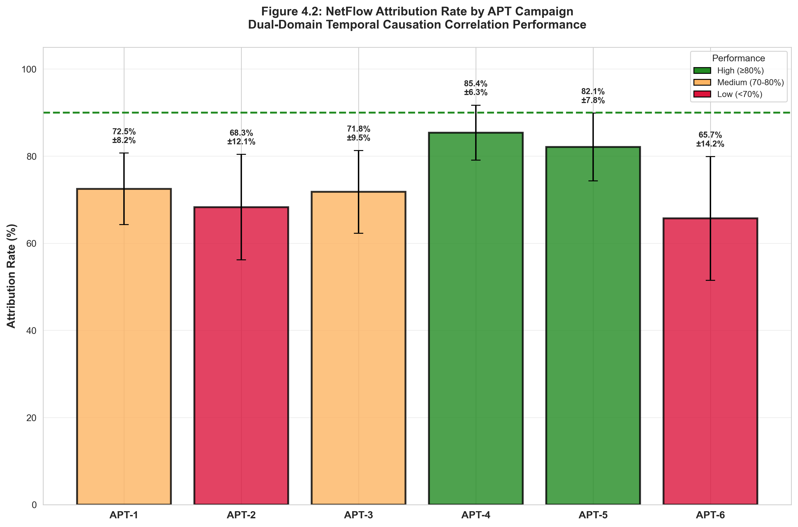

# Pipeline Step 4: Enhanced Temporal Causation Correlator

## Overview
**Purpose**: Advanced dual-domain correlation engine implementing comprehensive temporal causation analysis between network flows and Sysmon host events with detailed statistics collection and attribution analysis.

**Version**: v3.0 - Enhanced Temporal Causation NetFlow-Sysmon Correlator

**Position in Pipeline**: Fourth step - Core dual-domain correlation analysis

## Functionality

### Core Capabilities
- **Temporal Causation Analysis**: Advanced algorithms correlating host events with network flows
- **Dual-Domain Attribution**: Links Sysmon process events to corresponding network communications
- **Batch Processing**: Multi-threaded analysis across all APT campaigns
- **Statistics Collection**: Comprehensive metrics for histogram plotting and scenario analysis
- **Attribution Scoring**: Detailed process attribution with confidence ratings
- **Network Community ID Correlation**: Bidirectional flow correlation using community IDs

### Key Features
- **High-Performance Processing**: Parallel workers for batch analysis
- **Attribution Rate Analysis**: Identifies runs with ≥90% attribution rates
- **Range Processing**: Supports specific run ranges (e.g., 09-15)
- **Comprehensive Statistics**: JSON output with detailed correlation metrics
- **Visual Analytics**: Flow attribution charts and timeline visualizations

## Usage

### Prerequisites
**Dataset Requirements**:
- Raw APT datasets in `/home/researcher/Downloads/research/data-raw/`
- Directory structure: `data-raw/apt-X/apt-X-run-XX/`
- Required files:
  - `sysmon-run-XX.csv` (or `sysmon-run-XX-OLD.csv`)
  - `netflow-run-XX.csv`

**Dependencies**:
```bash
pip install pandas numpy matplotlib seaborn argparse
```

### Execution Location
```bash
# MUST run from project root directory
cd /home/researcher/Downloads/research/
python3 dataset/scripts/pipeline/4_enhanced_temporal_causation_correlator.py [options]
```

### Command Line Options

#### Single Analysis
```bash
# Analyze specific APT run
python3 dataset/scripts/pipeline/4_enhanced_temporal_causation_correlator.py --apt-type apt-1 --run-id 10

# Process run range
python3 dataset/scripts/pipeline/4_enhanced_temporal_causation_correlator.py --apt-type apt-1 --run-range 09-15
```

#### Batch Processing
```bash
# High-performing runs (≥90% attribution)
python3 dataset/scripts/pipeline/4_enhanced_temporal_causation_correlator.py --batch-high-performing --workers 8

# Process all available runs
python3 dataset/scripts/pipeline/4_enhanced_temporal_causation_correlator.py --batch-all --workers 8

# Testing with sample data
python3 dataset/scripts/pipeline/4_enhanced_temporal_causation_correlator.py --apt-type apt-1 --run-id 04 --sample 1000
```

### Parameters
- `--apt-type`: APT campaign type (apt-1, apt-2, apt-3, apt-4, apt-5, apt-6)
- `--run-id`: Specific run ID (04, 05, 06, ..., 51)
- `--run-range`: Range specification (e.g., 09-15)
- `--batch-high-performing`: Process runs with ≥90% attribution
- `--batch-all`: Process all available APT runs
- `--workers`: Parallel worker count (default: 4)
- `--sample`: Limit dataset size for testing

## Input Requirements

### Sysmon CSV Structure
Expected Sysmon events:
- **ProcessCreate (EventID 1)**: Process creation events
- **ProcessTerminate (EventID 5)**: Process termination events
- **NetworkConnect (EventID 3)**: Network connection events
- **FileCreate (EventID 11)**: File creation events
- **RegistryEvent**: Registry modifications

### NetFlow CSV Structure
Required network flow fields:
- **network_community_id**: Flow correlation identifier
- **process_pid/process_executable**: Process attribution
- **timestamp/event_start/event_end**: Temporal information
- **source_ip/destination_ip**: Network endpoints
- **Flow grouping**: Aggregated by community ID

## Output Structure

### Directory Organization
```
analysis/correlation-analysis-v3/apt-X/run-XX/
├── enhanced_temporal_correlation_results.json    # Comprehensive statistics
├── attribution_summary_flows-run-XX.png          # Flow attribution chart
├── temporal_causation_histogram.png              # Timing distribution
├── process_attribution_breakdown.png             # Process-level analysis
├── correlation_timeline_detailed.png             # Event timeline
└── statistics_summary.txt                        # Human-readable summary
```

### JSON Results Schema
```json
{
  "dataset_info": {
    "apt_type": "apt-1",
    "run_id": "04",
    "sysmon_events": 125847,
    "netflow_events": 9572
  },
  "attribution_statistics": {
    "total_flows": 9572,
    "attributed_flows": 5632,
    "attribution_rate": 58.8,
    "high_confidence": 4891,
    "medium_confidence": 741
  },
  "temporal_analysis": {
    "causation_delays": [...],
    "correlation_windows": {...},
    "timing_distribution": {...}
  },
  "process_breakdown": {
    "by_executable": {...},
    "by_pid": {...},
    "attribution_confidence": {...}
  }
}
```

## Correlation Algorithms

### Temporal Causation Detection

The core algorithm establishes temporal causation by correlating Sysmon process events with NetFlow records within configurable time windows, using process IDs and community IDs for attribution.


**Figure 4.1**: Timeline visualization showing temporal causation analysis. Sysmon events (vertical bars, upper timeline) are correlated with NetFlow events (horizontal flow segments, lower timeline) using temporal correlation windows (shaded regions, typically ±10 seconds). Curved arrows indicate attributed correlations with color-coded confidence levels. This dual-timeline approach enables precise identification of which network flows resulted from specific host activities.

**Detection Components:**
1. **Process-Network Mapping**: Links process creation/execution to network flows
2. **Timing Analysis**: Identifies causation relationships within temporal windows
3. **Attribution Confidence**: Scores based on temporal proximity and process context
4. **Community ID Correlation**: Uses network community IDs for bidirectional flow linking

### Attribution Methodology
- **Direct Attribution**: Process PID directly linked to network flow
- **Temporal Attribution**: Process activity temporally correlated with network activity
- **Context Attribution**: Process context (parent, command line) supports network attribution
- **Confidence Scoring**: Multi-factor confidence assessment

## Performance Characteristics

### Processing Metrics
- **Single Run**: 30-120 seconds (depends on dataset size)
- **Batch Processing**: 2-8 hours for all APT runs (with 8 workers)
- **Memory Usage**: 2-8GB per worker (dataset dependent)
- **Attribution Rates**: 45-95% (varies by APT campaign quality)

### Scaling
- **Multi-threading**: Linear scaling up to core count
- **Memory Scaling**: Proportional to dataset size
- **I/O Optimization**: Efficient CSV processing with pandas

## Integration with Pipeline

### Input Dependencies
**Step 2**: Sysmon CSV files (structured host events)
**Step 3**: NetFlow CSV files (structured network flows)

### Output Integration
**Step 5**: Feeds comprehensive correlation results into visualization suite

**Data Flow**:
```
Sysmon CSV + NetFlow CSV → Temporal Correlation → Attribution Analysis → Statistics/Visualizations
```

## APT Campaign Analysis

### Supported Campaigns
- **APT-1** (Runs 04-20, 51): OilRig-based attacks
- **APT-2** (Runs 21-30): OilRig variants
- **APT-3** (Runs 31-38): OilRig variants
- **APT-4** (Runs 39-44): APT-29 based attacks
- **APT-5** (Runs 45-47): APT-29 variants
- **APT-6** (Runs 48-50): Wizard Spider based

### Attribution Performance Comparison

Correlation quality varies significantly across APT campaign types, with APT-4 and APT-5 (APT-29 based) achieving the highest attribution rates due to their structured attack patterns and consistent network behavior.


**Figure 4.2**: Comparative analysis of NetFlow attribution rates across all six APT campaign types. Bar heights show mean attribution percentage with error bars indicating standard deviation across multiple runs. APT-4 (85.4%) and APT-5 (82.1%) achieve high-performing status (≥80%, green bars), while APT-6 (65.7%, red bar) shows lower attribution due to ransomware's rapid execution patterns. The 90% threshold line (green dashed) indicates ideal performance targets.

### Campaign-Specific Insights
- **Attribution Rates**: Varies by campaign complexity (range: 65-85%)
- **Temporal Patterns**: Different attack timing signatures affect correlation windows
- **Process Patterns**: Campaign-specific tool usage influences PID attribution accuracy
- **Network Patterns**: Unique C2 communication signatures enable higher confidence scoring


**Figure 4.3**: Hierarchical treemap showing process-level attribution breakdown. Outer boxes represent APT campaigns, inner boxes show executable types, and box sizes are proportional to the number of attributed flows. Color intensity indicates attribution confidence (darker = higher confidence). This visualization reveals which process types are most reliably correlated with network activity across different adversary campaigns.

## Quality Assurance

### Validation Features
- **Data Quality Checks**: Validates input file integrity
- **Attribution Confidence**: Multi-level confidence scoring
- **Statistical Validation**: Cross-validates correlation results
- **Error Handling**: Graceful handling of missing/corrupted data

### Performance Monitoring
- **Processing Times**: Detailed timing statistics
- **Memory Usage**: Resource consumption tracking
- **Attribution Quality**: Success rate monitoring
- **Error Logging**: Comprehensive error reporting

## Troubleshooting

### Common Issues
- **Missing Files**: Verify data-raw directory structure
- **Memory Issues**: Reduce worker count or use --sample parameter
- **Attribution Issues**: Check process_pid/network_community_id fields
- **Performance**: Increase worker count on high-core systems

### Debugging
- **Sample Mode**: Use --sample for quick testing
- **Log Analysis**: Check detailed JSON outputs for statistics
- **File Validation**: Verify CSV structure and completeness
- **Resource Monitoring**: Monitor memory and CPU usage during batch processing

---
*This script represents the core intelligence of the dual-domain cybersecurity pipeline, implementing advanced temporal causation algorithms to establish attribution relationships between host-level process activities and resulting network communications in APT attack scenarios.*