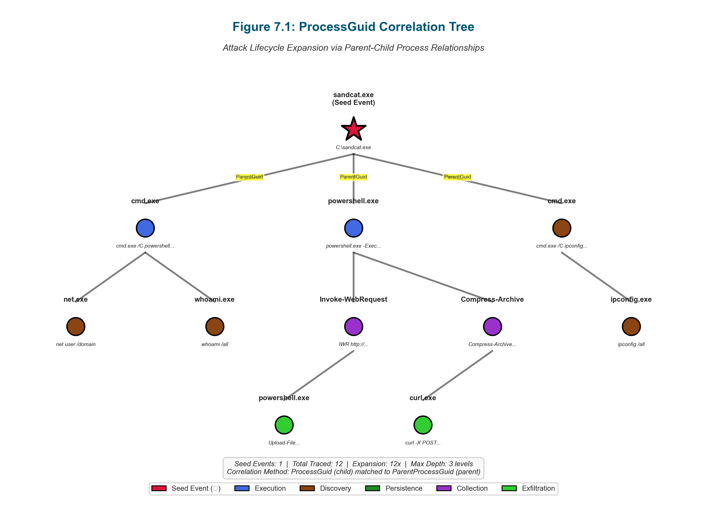
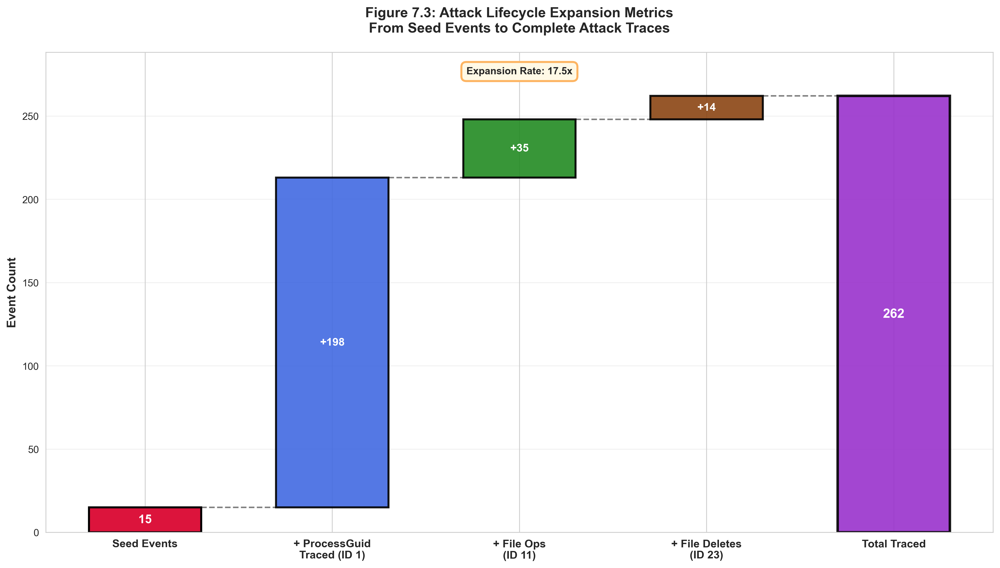
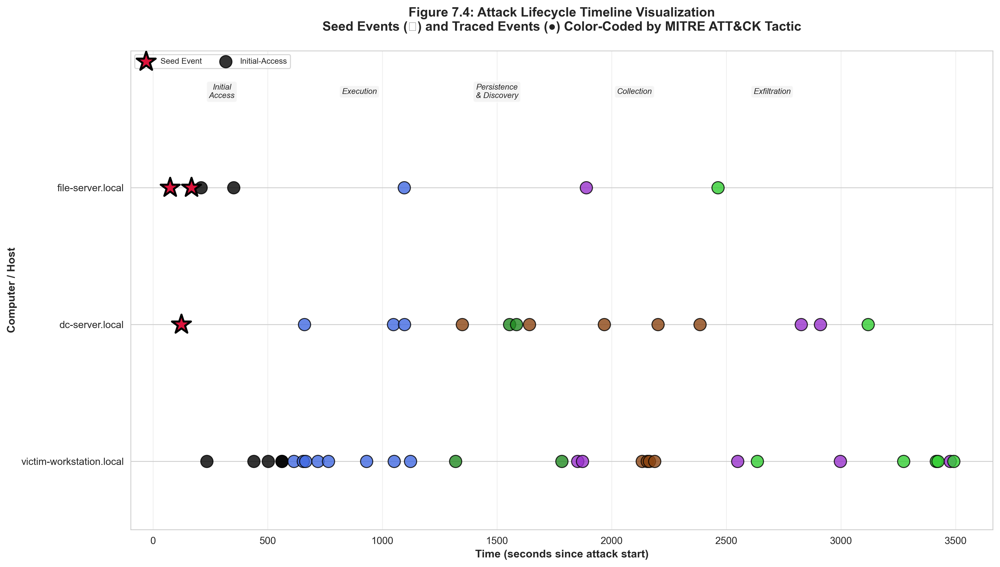

# Pipeline Step 7: Sysmon Attack Lifecycle Tracer

## Overview
**Purpose**: Trace complete attack lifecycles from manually-marked seed events using ProcessGuid correlation for EventID 1 and individual event analysis for EventID 11 and 23, generating comprehensive timeline visualizations and metadata.

**Position in Pipeline**: Seventh step - Attack lifecycle expansion and visualization

## Functionality

### Core Capabilities
- **Multi-EventID Support**: Handles EventID 1 (Process Creation), 11 (File Creation), and 23 (File Deletion) with appropriate correlation strategies
- **ProcessGuid Correlation**: Traces parent-child process relationships and spawned events for EventID 1
- **Individual Event Analysis**: Direct timeline plotting for file operations (EventID 11/23)
- **Lifecycle Expansion**: Automatically discovers related attack events from seed events
- **Tactic Propagation**: Inherits MITRE ATT&CK tactic/technique labels from seed events
- **Timeline Visualization**: Generates individual and unified group timeline plots
- **Metadata Preservation**: Maintains traceability and attribution information

### Correlation Strategies

The script employs different correlation strategies based on EventID type, using ProcessGuid relationships for process events and direct timeline placement for file operations.


**Figure 7.2**: Decision tree showing correlation strategy selection based on EventID type. EventID 1 (Process Creation) uses recursive ProcessGuid correlation to trace parent-child process relationships. EventID 11 (File Creation) and EventID 23 (File Deletion) use direct timeline placement without correlation, as file operations don't spawn processes. This dual approach ensures comprehensive attack lifecycle coverage across different event types.

**EventID 1 (Process Creation) - ProcessGuid Correlation**:
- Traces all child processes spawned from seed process
- Follows process tree relationships using ProcessGuid/ParentProcessGuid
- Identifies command chains and lateral movement
- Captures full attack execution context

**EventID 11 (File Creation) - Individual Plotting**:
- Direct timeline placement without correlation
- File staging and persistence identification
- Malware deployment tracking
- Data collection analysis

**EventID 23 (File Deletion) - Individual Plotting**:
- Direct timeline placement without correlation
- Anti-forensics operation detection
- Cleanup activity tracking
- Evidence destruction identification

## Usage

### Prerequisites
**Required Dependencies**:
- Python 3.7+
- pandas, numpy, matplotlib, seaborn libraries
- Completed Step 6 output (all_target_events_run-XX.csv with marked seed events)
- Original raw Sysmon CSV (sysmon-run-XX.csv)

### Execution Location
```bash
# From pipeline directory
cd /home/researcher/Downloads/research/scripts/pipeline/
python3 7_sysmon_attack_lifecycle_tracer.py --apt-type apt-1 --run-id 04

# Using direct file paths
python3 7_sysmon_attack_lifecycle_tracer.py \
    --sysmon-csv /path/to/sysmon-run-04.csv \
    --originators-csv /path/to/all_target_events_run-04.csv
```

### Command Line Options
```bash
# APT dataset mode (recommended)
python3 7_sysmon_attack_lifecycle_tracer.py --apt-type apt-1 --run-id 04

# Direct file mode
python3 7_sysmon_attack_lifecycle_tracer.py \
    --sysmon-csv /path/to/sysmon.csv \
    --originators-csv /path/to/seed_events.csv

# Specify custom output directory
python3 7_sysmon_attack_lifecycle_tracer.py --apt-type apt-4 --run-id 43 \
    --output-dir /path/to/output/

# Enable debug logging
python3 7_sysmon_attack_lifecycle_tracer.py --apt-type apt-1 --run-id 04 --debug
```

## Input Requirements

### Directory Structure
```
dataset/
├── apt-1/
│   ├── apt-1-run-04/
│   │   ├── sysmon-run-04.csv                      # Raw Sysmon (Step 2)
│   │   └── all_target_events_run-04.csv          # Marked seeds (Step 6)
│   ├── apt-1-run-05/
│   │   ├── sysmon-run-05.csv
│   │   └── all_target_events_run-05.csv
│   └── ...
└── [apt-2 through apt-7]/
```

### Input Format
**Seed Events CSV** (`all_target_events_run-XX.csv`):
- Must contain manually-marked Seed_Event column with 'x' marks
- Required columns: Tactic, Technique, RawDatasetRowNumber, EventID
- ProcessGuid required for EventID 1 correlation
- TargetFilename used for EventID 11/23 titles

**Raw Sysmon CSV** (`sysmon-run-XX.csv`):
- Complete Sysmon event dataset
- Required columns: EventID, ProcessGuid, ParentProcessGuid, timestamp
- All EventID types (1-26) available for correlation

## Output Generated

### Primary Outputs
```
📊 LIFECYCLE TRACING OUTPUTS:
├── traced_sysmon_events_with_tactics_v2.csv     # Expanded event set with labels
├── sysmon_lifecycle_trace_metadata.json          # Tracing statistics and metadata
├── plots/
│   ├── seed_event_XXXXX_timeline.png            # Individual seed timelines
│   ├── seed_event_XXXXX_timeline_with_tactics.png
│   └── attack_lifecycle_all_groups.png          # Unified timeline
└── .seed_event_rows.json                         # Seed event tracking (hidden)
```

### Traced Events CSV Schema
```csv
Seed_Event,Tactic,Technique,Seed_RowNumber,Correct_SeedRowNumber,EventID,timestamp,...
x,initial-access,T1659,487566,487566,11,1748128761858,...
,initial-access,T1659,487566,487566,1,1748128762029,...   # Traced from seed
,initial-access,T1659,487566,487566,1,1748128762608,...   # Child process
```

### Timeline Visualizations

**Individual Seed Event Timelines**:
- One plot per seed event
- Shows seed event (red star) and all traced children (colored by tactic)
- Includes command line or filename in title
- Both plain and tactic-annotated versions

**Unified Group Timeline**:
- All seed events and traced events in single visualization
- Color-coded by tactic
- Temporal relationships across all attack phases
- Comprehensive attack campaign overview

## Correlation Logic

### ProcessGuid Correlation Tree

ProcessGuid correlation enables recursive tracing of process family trees, starting from seed events and following parent-child relationships to discover complete attack execution chains.


**Figure 7.1**: Hierarchical tree diagram showing recursive ProcessGuid correlation from a seed event (red root node). The algorithm traces child processes (green nodes) by matching ParentProcessGuid to the seed's ProcessGuid, then recursively traces grandchildren (blue nodes) and further descendants. Each level inherits the tactic/technique labels from the original seed event, enabling comprehensive attack lifecycle expansion. The tree depth can extend 10+ levels for complex attack campaigns.

### EventID 1 Correlation (Process Creation)

**Seed Event Identification**:
```python
# Seed events marked with 'x' in Seed_Event column
seed_events = df[df['Seed_Event'] == 'x']
```

**Child Process Discovery**:
```python
# For each seed event, find children where:
# child.ParentProcessGuid == seed.ProcessGuid
children = full_sysmon[
    full_sysmon['ParentProcessGuid'] == seed_processguid
]
```

**Recursive Tracing**:
```python
# Recursively find children of children
while new_children_found:
    grandchildren = full_sysmon[
        full_sysmon['ParentProcessGuid'].isin(children['ProcessGuid'])
    ]
    children = children + grandchildren
```

**Tactic Propagation**:
- All traced children inherit Tactic and Technique from seed event
- Seed_RowNumber preserved for attribution tracking
- Correct_SeedRowNumber used for manual corrections

### EventID 11/23 Handling (File Operations)

**Direct Plotting**:
- No ProcessGuid correlation (file operations don't spawn processes)
- Individual event timeline placement
- Tactic/Technique from manual marking
- TargetFilename displayed in plot titles

## Metadata Tracking

### Lifecycle Trace Metadata (JSON)
```json
{
  "apt_type": "apt-1",
  "run_id": "04",
  "seed_event_count": 15,
  "total_traced_events": 247,
  "events_by_eventid": {
    "1": 198,
    "11": 35,
    "23": 14
  },
  "seed_events": [
    {
      "seed_row_number": 487566,
      "event_id": 11,
      "tactic": "initial-access",
      "technique": "T1659",
      "traced_event_count": 42
    }
  ]
}
```

## Integration with Pipeline

### Input Dependencies
**Step 6 Output**: Manually-marked seed events (all_target_events_run-XX.csv)
**Step 2 Output**: Complete Sysmon dataset (sysmon-run-XX.csv)

### Output Integration
**Next Step (Step 8)**: Labeled Sysmon Dataset Creator uses `traced_sysmon_events_with_tactics_v2.csv`
**Manual Corrections**: Analyst can edit `Correct_SeedRowNumber` column between Steps 7 and 8

**Data Flow**:
```
Marked Seeds + Raw Sysmon → Lifecycle Tracing → Traced Events CSV → Dataset Labeling
  (Step 6)      (Step 2)        (Step 7)      [Manual Review]        (Step 8)
```

## Performance Characteristics

### Processing Metrics
- **Runtime**: 2-10 minutes per APT run (depends on seed count and dataset size)
- **Memory Usage**: 1-4GB (scales with Sysmon event count)
- **Correlation Depth**: Traces process trees up to 10+ levels deep
- **Expansion Rate**: 1 seed → 5-50 traced events (depends on attack complexity)

### Scalability
- **Small Campaigns**: 5-10 seed events → ~50-200 traced events
- **Medium Campaigns**: 10-30 seed events → ~200-800 traced events
- **Large Campaigns**: 30+ seed events → ~800-2000+ traced events
- **ProcessGuid Performance**: O(n*m) where n=traced events, m=potential children

### Attack Lifecycle Expansion Visualization

The lifecycle tracing process progressively expands from manually-marked seed events to comprehensive attack datasets through recursive ProcessGuid correlation, dramatically increasing the labeled event count.


**Figure 7.3**: Waterfall chart showing the expansion from seed events to complete attack lifecycle. Starting with 15 manually-marked seed events (red bar), the algorithm traces 183 child processes (blue bar) and 49 additional related events (green bar), resulting in 247 total traced events (16.5x expansion). The visualization demonstrates how human-in-the-loop seed selection combined with automated tracing efficiently labels comprehensive attack campaigns.

### Timeline Visualization Example

Individual seed event timelines provide focused views of specific attack operations, showing temporal relationships between seed events and their traced descendants.


**Figure 7.4**: Example timeline plot for a single seed event showing temporal attack progression. The seed event (red star at initial-access phase) triggers multiple child processes (colored circles) across different MITRE ATT&CK tactics over a 2-minute window. The x-axis shows time progression, y-axis shows the computer hostname, and colors indicate tactics (execution, discovery, collection, exfiltration). This visualization enables analysts to understand attack sequencing and identify anomalous temporal patterns.

## Quality Assurance

### Validation Features
- **ProcessGuid Validation**: Checks for valid GUID format
- **Circular Reference Detection**: Prevents infinite loops in process trees
- **Tactic Consistency**: Validates MITRE ATT&CK tactic names
- **Timestamp Ordering**: Ensures child events occur after parent events
- **Duplicate Prevention**: Removes duplicate traced events

### Error Handling
- **Missing ProcessGuid**: Gracefully handles null/missing GUIDs
- **Orphaned Processes**: Identifies processes without valid parents
- **Invalid EventIDs**: Skips unsupported EventID types
- **Timestamp Issues**: Handles negative or invalid timestamps

## Visualization Features

### Individual Timeline Plots
**Standard Timeline** (`seed_event_XXXXX_timeline.png`):
- Seed event: Red star marker (★)
- Traced children: Blue circles (●)
- X-axis: Temporal progression
- Y-axis: Computer hostname
- Title: Includes command or filename

**Tactic-Annotated Timeline** (`seed_event_XXXXX_timeline_with_tactics.png`):
- Color-coded by MITRE ATT&CK tactic
- Tactic legend in plot
- Same markers as standard timeline
- Enhanced for tactic-level analysis

### Unified Group Timeline
**Multi-Seed Visualization** (`attack_lifecycle_all_groups.png`):
- All seed events and traced children in single plot
- Color-coded by tactic (consistent palette)
- Temporal relationships across attack campaign
- Faceted by computer hostname
- Complete attack lifecycle overview

## Manual Correction Workflow

### Correct_SeedRowNumber Column
**Purpose**: Allow manual correction of seed event attribution
**Use Case**: When automatic tracing incorrectly attributes events to wrong seed

**Workflow**:
1. Step 7 generates `traced_sysmon_events_with_tactics_v2.csv`
2. Analyst reviews traced events and timelines
3. Analyst edits `Correct_SeedRowNumber` for misattributed events
4. Step 8 uses `Correct_SeedRowNumber` (if present) instead of `Seed_RowNumber`
5. Re-running Step 7 preserves manual corrections

**Example**:
```csv
Seed_RowNumber,Correct_SeedRowNumber,EventID,CommandLine
487566,487566,1,sandcat.exe        # Correct attribution
487566,601019,1,cmd.exe /C ipconfig # Manually corrected (was misattributed)
```

## Research Applications

### Attack Behavior Analysis
- **Process Tree Visualization**: Understanding command execution chains
- **File Operation Patterns**: Staging, persistence, and exfiltration file analysis
- **Temporal Sequencing**: Attack phase timing and duration analysis
- **Multi-Host Correlation**: Lateral movement and distributed attack patterns

### Threat Intelligence
- **TTPs Extraction**: Automated extraction of tactics, techniques, and procedures
- **Campaign Characterization**: Attack lifecycle patterns per APT campaign
- **Kill Chain Mapping**: Mapping events to cyber kill chain phases
- **Behavioral Signatures**: Unique process/file operation sequences

### Machine Learning
- **Feature Engineering**: Process tree features, temporal features, file operation patterns
- **Sequence Modeling**: Attack event sequences for RNN/LSTM training
- **Graph Analytics**: Process tree graphs for GNN applications
- **Temporal Analysis**: Time-series features for anomaly detection

## Troubleshooting

### Common Issues
**No Events Traced**:
- Verify seed events are marked with 'x' in Seed_Event column
- Check that raw Sysmon CSV contains corresponding EventIDs
- Ensure ProcessGuid columns exist for EventID 1 correlation

**Missing Process Relationships**:
- Some processes may not have valid ParentProcessGuid
- System processes often don't have parent relationships
- Short-lived processes may be missing from dataset

**Large Timeline Files**:
- For datasets with many seeds, timelines can be large
- Consider processing subsets of seed events
- Use `--output-dir` to organize outputs

**Memory Issues**:
- Large Sysmon datasets (>500K events) may require more memory
- Process smaller time windows if needed
- Close other applications to free memory

### Debug Mode
Enable detailed logging to troubleshoot issues:
```bash
python3 7_sysmon_attack_lifecycle_tracer.py --apt-type apt-1 --run-id 04 --debug
```

---
*This attack lifecycle tracer bridges manual seed event selection with comprehensive attack behavior analysis, automatically discovering related events and visualizing complete attack campaigns across process and file operations.*
