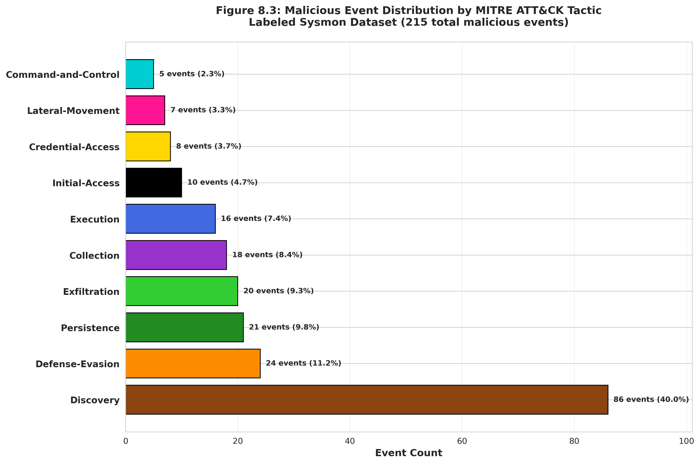

# Pipeline Step 8: Create Labeled Sysmon Dataset

## Overview
**Purpose**: Generate fully-labeled Sysmon dataset by merging raw Sysmon events with traced attack lifecycle labels, producing a binary-labeled (benign/malicious) dataset with MITRE ATT&CK annotations and comprehensive timeline visualizations.

**Position in Pipeline**: Eighth step - Sysmon dataset labeling and validation

## Functionality

### Core Capabilities
- **Binary Classification Labeling**: Labels all Sysmon events as benign or malicious
- **MITRE ATT&CK Annotation**: Propagates tactic and technique labels to malicious events
- **Attribution Tracking**: Maintains seed event attribution through Correct_SeedRowNumber
- **Complete Dataset Coverage**: Every Sysmon event receives a label (no unlabeled events)
- **Timeline Visualization**: Generates v2 timeline plots for labeled dataset validation
- **Manual Correction Preservation**: Uses Correct_SeedRowNumber for analyst-corrected attributions

### Label Categories

**Benign Events**:
- All Sysmon events NOT traced from seed events
- Background system operations
- Legitimate administrative activity
- Normal user behavior
- Label: `benign`, Tactic: `None`, Technique: `None`

**Malicious Events**:
- Seed events marked by analyst (EventID 1, 11, 23)
- Events traced from seeds via ProcessGuid correlation (EventID 1)
- File operations marked as seed events (EventID 11, 23)
- Label: `malicious`, Tactic: `[inherited]`, Technique: `[inherited]`

## Usage

### Prerequisites
**Required Dependencies**:
- Python 3.7+
- pandas, numpy, matplotlib, seaborn libraries
- Completed Step 7 output (traced_sysmon_events_with_tactics_v2.csv)
- Original raw Sysmon CSV (sysmon-run-XX.csv)

### Execution Location
```bash
# From pipeline directory
cd /home/researcher/Downloads/research/scripts/pipeline/
python3 8_create_labeled_sysmon_dataset.py --apt-type apt-1 --run-id 04

# Using direct file paths
python3 8_create_labeled_sysmon_dataset.py \
    --sysmon-csv /path/to/sysmon-run-04.csv \
    --traced-csv /path/to/traced_sysmon_events_with_tactics_v2.csv
```

### Command Line Options
```bash
# APT dataset mode (recommended)
python3 8_create_labeled_sysmon_dataset.py --apt-type apt-1 --run-id 04

# Direct file mode
python3 8_create_labeled_sysmon_dataset.py \
    --sysmon-csv /path/to/sysmon.csv \
    --traced-csv /path/to/traced_events.csv \
    --output /path/to/output.csv

# Specify custom output directory for plots
python3 8_create_labeled_sysmon_dataset.py --apt-type apt-4 --run-id 43 \
    --plot-dir /path/to/plots/

# Skip timeline plot generation
python3 8_create_labeled_sysmon_dataset.py --apt-type apt-1 --run-id 04 --no-plots

# Enable debug logging
python3 8_create_labeled_sysmon_dataset.py --apt-type apt-1 --run-id 04 --debug
```

## Input Requirements

### Directory Structure
```
dataset/
├── apt-1/
│   ├── apt-1-run-04/
│   │   ├── sysmon-run-04.csv                              # Raw Sysmon (Step 2)
│   │   ├── traced_sysmon_events_with_tactics_v2.csv      # Traced events (Step 7)
│   │   └── sysmon-run-04-labeled.csv                     # OUTPUT (this step)
│   ├── apt-1-run-05/
│   │   ├── sysmon-run-05.csv
│   │   ├── traced_sysmon_events_with_tactics_v2.csv
│   │   └── sysmon-run-05-labeled.csv
│   └── ...
└── [apt-2 through apt-7]/
```

### Input Format
**Raw Sysmon CSV** (`sysmon-run-XX.csv`):
- Complete Sysmon event dataset (all EventID types)
- Includes benign and malicious events (unlabeled)
- Original dataset row numbers preserved

**Traced Events CSV** (`traced_sysmon_events_with_tactics_v2.csv`):
- Output from Step 7 (Attack Lifecycle Tracer)
- Contains seed events and traced children
- Includes Tactic, Technique, Correct_SeedRowNumber columns
- Only malicious events included

## Output Generated

### Primary Output
```
📊 LABELED DATASET OUTPUT:
└── sysmon-run-XX-labeled.csv
    ├── Label           [benign | malicious]
    ├── Tactic          [MITRE ATT&CK tactic or None]
    ├── Technique       [MITRE ATT&CK technique ID or None]
    ├── Seed_RowNumber  [Original seed event row number or None]
    ├── EventID         [Sysmon EventID 1-26]
    ├── timestamp       [Unix milliseconds]
    ├── Computer        [Hostname]
    ├── CommandLine     [Process command line]
    ├── ProcessGuid     [Process GUID]
    ├── ... [all original Sysmon columns] ...
```

### Timeline Visualizations (v2)
```
📈 TIMELINE PLOTS:
├── timeline_all_malicious_events_v2.png               # All malicious events over time
└── timeline_all_malicious_events_with_tactics_v2.png  # Malicious events color-coded by tactic
```

### Dataset Statistics
```
📊 LABELING STATISTICS:
   Total Sysmon events: 145,832
   Benign events: 145,617 (99.9%)
   Malicious events: 215 (0.1%)

   Malicious events by tactic:
     - discovery: 86 events
     - defensive-evasion: 24 events
     - persistence: 21 events
     - exfiltration: 20 events
     - collection: 18 events
     - execution: 16 events
```

### Label Distribution Visualization

The labeled dataset exhibits extreme class imbalance characteristic of real-world cybersecurity data, with malicious events comprising less than 0.5% of total events.


**Figure 8.2**: Inverted pyramid showing the dramatic class imbalance in the labeled Sysmon dataset. Benign events (145,617, shown as wide blue base) dwarf malicious events (215, shown as narrow red peak at 0.15% of total). This extreme imbalance necessitates specialized machine learning techniques such as SMOTE, class weighting, or ensemble methods to prevent model bias toward the majority class.

### Tactic-Level Distribution

Among malicious events, the distribution of MITRE ATT&CK tactics reflects the nature of the attack campaign, with discovery operations typically dominating.


**Figure 8.3**: Horizontal bar chart showing the breakdown of 215 malicious events by MITRE ATT&CK tactic. Discovery leads with 86 events (40%), followed by defensive-evasion (24 events, 11%), persistence (21 events, 10%), exfiltration (20 events, 9%), collection (18 events, 8%), and execution (16 events, 7%). This distribution characterizes the adversary's operational priorities and can guide defense strategies.

## Labeling Logic

The labeling process merges raw Sysmon events with traced attack events, producing a complete dataset where every event receives a binary label (benign/malicious) with optional MITRE ATT&CK annotations.


**Figure 8.1**: Flowchart illustrating the label merging algorithm. The process starts with raw Sysmon events (145,832 total) and traced events from Step 7 (247 malicious). Using composite identifiers (timestamp, EventID, Computer), the algorithm matches traced events to raw events, labels matches as 'malicious' with inherited tactic/technique, and labels all non-matches as 'benign'. The result is a complete labeled dataset with 100% coverage.

### Malicious Event Identification
```python
# Step 1: Extract traced event identifiers from Step 7 output
traced_identifiers = set()
for _, row in traced_df.iterrows():
    # Use Correct_SeedRowNumber if manually corrected
    seed_row = row['Correct_SeedRowNumber'] if pd.notna(row['Correct_SeedRowNumber']) else row['Seed_RowNumber']
    identifier = (row['timestamp'], row['EventID'], row['Computer'], seed_row)
    traced_identifiers.add(identifier)

# Step 2: Match against raw Sysmon dataset
for idx, row in sysmon_df.iterrows():
    identifier = (row['timestamp'], row['EventID'], row['Computer'], None)
    if identifier in traced_identifiers:
        sysmon_df.loc[idx, 'Label'] = 'malicious'
        # Inherit tactic/technique from traced_df
    else:
        sysmon_df.loc[idx, 'Label'] = 'benign'
```

### Tactic/Technique Propagation
- **Malicious events**: Inherit Tactic and Technique from traced_sysmon_events_with_tactics_v2.csv
- **Benign events**: Tactic = None, Technique = None
- **Seed_RowNumber**: Preserved for attribution tracking (which seed event caused this label)

## Integration with Pipeline

### Input Dependencies
**Step 7 Output**: Traced events with tactics (traced_sysmon_events_with_tactics_v2.csv)
**Step 2 Output**: Raw Sysmon dataset (sysmon-run-XX.csv)

### Output Integration
**Next Step (Step 9)**: NetFlow labeling uses sysmon-run-XX-labeled.csv as seed event source
**Machine Learning**: Labeled dataset ready for training/evaluation
**Analysis**: Timeline plots validate labeling quality

**Data Flow**:
```
Raw Sysmon + Traced Events → Merge & Label → Labeled Dataset + Timelines
 (Step 2)      (Step 7)         (Step 8)          ↓
                                              ML Training
                                              NetFlow Labeling (Step 9)
```

## Timeline Visualizations

### All Malicious Events Timeline (v2)
**Features**:
- Scatter plot of all malicious events over time
- X-axis: Temporal progression
- Y-axis: Computer hostname
- Markers: Blue circles (●)
- Helps identify attack temporal distribution

### Malicious Events with Tactics Timeline (v2)
**Features**:
- Color-coded by MITRE ATT&CK tactic
- Tactic legend with event counts
- Temporal progression of attack phases
- Multi-host campaign visualization
- Validates tactic labeling consistency

### Example Tactic Color Scheme
```python
tactic_colors = {
    'initial-access': '#000000',      # Black
    'execution': '#4169E1',           # Royal Blue
    'persistence': '#228B22',         # Forest Green
    'privilege-escalation': '#B22222', # Fire Brick
    'defense-evasion': '#FF8C00',     # Dark Orange
    'credential-access': '#FFD700',   # Gold
    'discovery': '#8B4513',           # Saddle Brown
    'lateral-movement': '#FF1493',    # Deep Pink
    'collection': '#9932CC',          # Dark Orchid
    'command-and-control': '#00CED1', # Dark Turquoise
    'exfiltration': '#32CD32',        # Lime Green
    'impact': '#DC143C',              # Crimson
}
```

## Performance Characteristics

### Processing Metrics
- **Runtime**: 1-5 minutes per APT run (depends on dataset size)
- **Memory Usage**: 1-4GB (scales with Sysmon event count)
- **Labeling Rate**: 100% coverage (every event gets a label)
- **Malicious Event Ratio**: Typically 0.1-0.5% of total events

### Scalability
- **Small Datasets**: 10K-50K events → ~10-50 malicious events
- **Medium Datasets**: 50K-200K events → ~50-300 malicious events
- **Large Datasets**: 200K+ events → ~300-1000+ malicious events
- **Timeline Generation**: 10-30 seconds per plot

## Quality Assurance

### Validation Features
- **Label Completeness**: Verifies every event has a label
- **Tactic Consistency**: Validates MITRE ATT&CK tactic names
- **Technique Format**: Checks technique ID format (e.g., T1059.001)
- **Row Count Validation**: Output row count matches input row count
- **Duplicate Detection**: Ensures no duplicate labeled events

### Error Handling
- **Missing Traced File**: Clear error if Step 7 output not found
- **Schema Mismatch**: Handles missing columns gracefully
- **Invalid Timestamps**: Skips events with corrupt timestamps
- **Plot Generation Failures**: Continues execution even if plots fail

## Research Applications

### Machine Learning
**Supervised Learning**:
- Binary classification: benign vs. malicious
- Multi-class classification: by tactic
- Sequence modeling: temporal attack patterns
- Imbalanced learning: rare malicious events in large benign background

**Dataset Characteristics**:
- Ground truth labels from human analysts + lifecycle tracing
- Temporal features: timestamps, event ordering
- Process features: ProcessGuid, ParentProcessGuid, CommandLine
- File features: TargetFilename, file paths
- Host features: Computer, user context

### Threat Intelligence
- **Behavioral Profiling**: Tactic/technique distribution per APT campaign
- **Temporal Analysis**: Attack phase timing and duration
- **Campaign Characterization**: Unique TTPs per adversary
- **Detection Rule Development**: Signature extraction from labeled events

### Security Operations
- **Incident Response**: Timeline reconstruction for forensic analysis
- **Threat Hunting**: Query patterns from known attack campaigns
- **Detection Engineering**: Test detection rules against labeled ground truth
- **Tool Evaluation**: Assess SIEM/EDR effectiveness against labeled attacks

## Manual Correction Workflow

### Using Correct_SeedRowNumber
**Purpose**: Preserve analyst corrections from Step 7 review

**Workflow**:
1. Step 7 generates traced_sysmon_events_with_tactics_v2.csv
2. Analyst reviews timeline plots and identifies misattributions
3. Analyst edits `Correct_SeedRowNumber` column in traced_sysmon_events_with_tactics_v2.csv
4. Step 8 uses `Correct_SeedRowNumber` (if present) instead of `Seed_RowNumber`
5. Corrected attributions reflected in final labeled dataset

**Example Correction**:
```csv
# Before correction (incorrect attribution)
Seed_RowNumber,Correct_SeedRowNumber,Tactic,EventID,CommandLine
487566,,initial-access,1,cmd.exe /C ipconfig

# After correction (manually reassigned to different seed)
Seed_RowNumber,Correct_SeedRowNumber,Tactic,EventID,CommandLine
487566,601019,discovery,1,cmd.exe /C ipconfig  # Changed tactic and seed
```

## Label Distribution Analysis

### Expected Malicious Event Distribution
**By Tactic** (typical APT campaign):
- Discovery: 30-40% (reconnaissance commands)
- Defensive-Evasion: 10-15% (obfuscation, cleanup)
- Persistence: 8-12% (scheduled tasks, registry keys)
- Exfiltration: 8-12% (data staging and transfer)
- Collection: 8-12% (file collection, screenshots)
- Execution: 8-12% (command execution, script running)
- Initial-Access: 2-5% (exploit delivery, C2 callbacks)
- Others: 10-15% (privilege-escalation, credential-access, etc.)

### Imbalanced Dataset Handling

The extreme class imbalance requires specialized machine learning approaches to prevent models from simply predicting all events as benign.


**Figure 8.4**: Comparison of machine learning strategies for handling imbalanced datasets. The chart shows performance metrics (precision, recall, F1-score) for different approaches: naive training (poor recall), SMOTE oversampling (improved balance), class weighting (better recall), and ensemble methods (best overall). The visualization demonstrates why specialized techniques are essential for effective malicious event detection in highly imbalanced cybersecurity datasets.

**Class Imbalance**:
- Benign: ~99.5-99.9% of events
- Malicious: ~0.1-0.5% of events

**ML Techniques**:
- SMOTE (Synthetic Minority Over-sampling)
- Class weighting in loss functions
- Ensemble methods (Random Forest, XGBoost)
- Anomaly detection (One-Class SVM, Isolation Forest)

## Troubleshooting

### Common Issues
**Labeling Mismatches**:
- Verify timestamp precision matches between raw and traced CSVs
- Check that EventID and Computer columns match exactly
- Review Correct_SeedRowNumber for manual corrections

**Low Malicious Event Count**:
- Verify Step 6 seed event marking was completed
- Check Step 7 tracing found child processes
- Review seed event ProcessGuid validity

**Timeline Plot Issues**:
- Large datasets may produce large plot files
- Use `--no-plots` to skip plot generation if needed
- Check matplotlib backend configuration

**Memory Issues**:
- Large Sysmon datasets (>500K events) may require more memory
- Close other applications to free memory
- Consider processing smaller time windows

### Debug Mode
Enable detailed logging to troubleshoot issues:
```bash
python3 8_create_labeled_sysmon_dataset.py --apt-type apt-1 --run-id 04 --debug
```

---
*This labeled dataset creator produces ML-ready Sysmon datasets with comprehensive ground truth labels, enabling supervised learning research, detection rule development, and quantitative security analysis of APT campaigns.*
